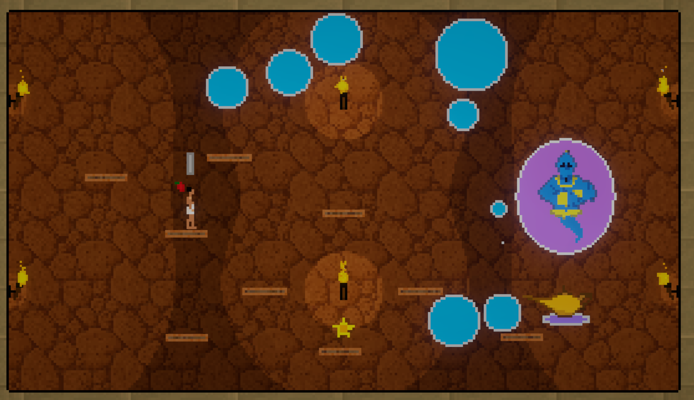

**Djimm's Revenge** is a single level simple platformer boss battle where you dodge genie bubbles, throw apples, and collect wishes. collect 3 and you win

i made **Djimm's Revenge** in a weekend for [Ludum Dare 55](https://ludumdare.com/)

it was good practice in actually completing a single-player game with art, sound, and a playable loop

i found royalty-free assets for music and art. i struggled a lot with animations and rigging, but finally learned to use [Mixamo](www.mixamo.com)

