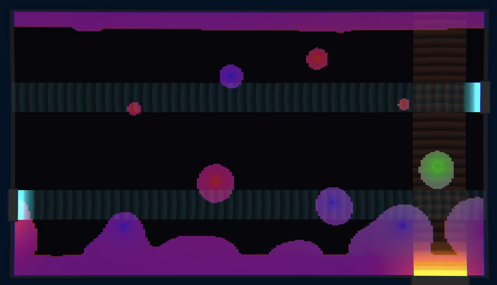

**Lovoflow** is a funky play-and-chill game that has you moving a lava bubble around a lamp using heat waves to collect orbs and grow the tranquility of the lamp

i made it solo for Global Game Jam, it was the first game jam entry where i created all of the assets myself including art, sound, code, etc. using tools everyone has access to like [Sonic Pi](https://sonic-pi.net/)

**Lovoflow** was used to practice a "blob shader" that i was working on for a different game idea, where the entire game is one single texture shader with all of the game state written to a 32x32 texture file. check out the [metaballs journal entry](/journal/texture-driven-games). 

the game was a good way to practice reading/writing with custom texture channels in shaders, but it showed me how much of a pain it can be to work with in-memory textures on WebGL

