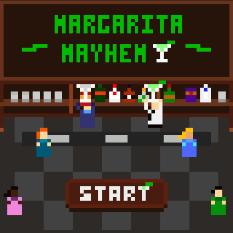

**Margarita Mayhem** is an arcade crossover between Frogger and Tapper where you play a barback in a hoppin' margarita bar

You help the bartender keep the drinks flowing by restocking booze, ice, and polishing the dishes

this project was super fun because it's based on a job i had in college working with my older brother Mike

**everything about the game is real!**

barbacking ain't easy and working in a club means you're nonstop dodging dancers, cleaning up spills, and hearing someone yell

DAVE WE NEED MORE ICE!

i made the game in a week for [LOWREZJAM](https://itch.io/jam/lowrezjam-2025/rate/3810595), a game jam where the max resolution is 64x64. i built it in Unity and hand crafted all the art, music, sounds, code etc

**Margarita Mayhem** was inspired by [Sushi Belt](https://munro.itch.io/sushi-belt)
