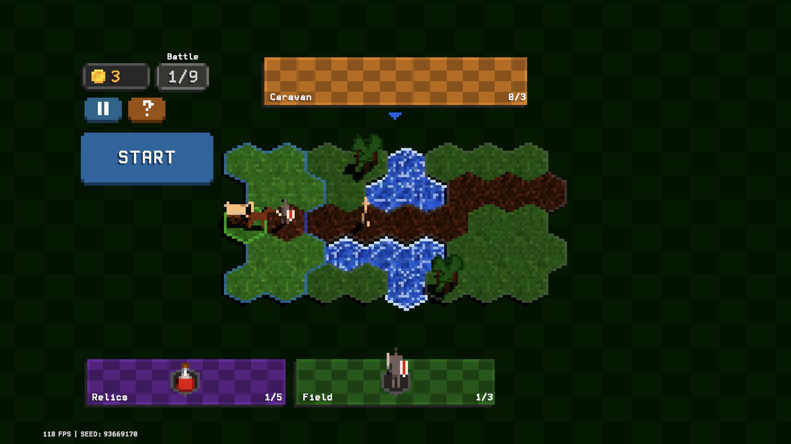
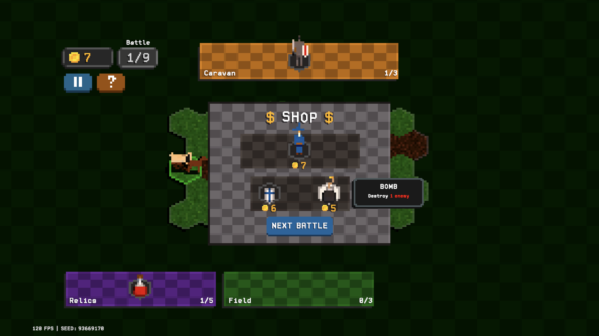
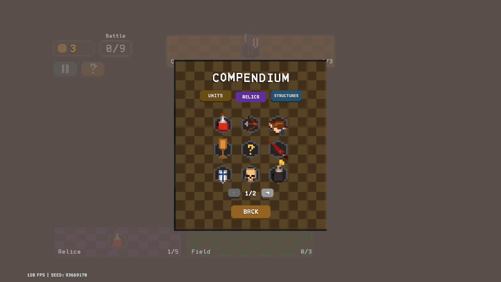

**Mlord** is a micro strategy roguelike where you deploy bodyguards to protect your caravan from danger while it makes its way across the kingsroad

it mixes unit management and hex-grid tower defense with light procedural elements to make a simple puzzle battler where game-altering relics help you outwit your foes

i drew inspiration from games like Balatro, Heroes of Might and Magic, and Into the Breach

**Mlord** is a work-in-progress, meant to be my first major release on Steam and mobile
