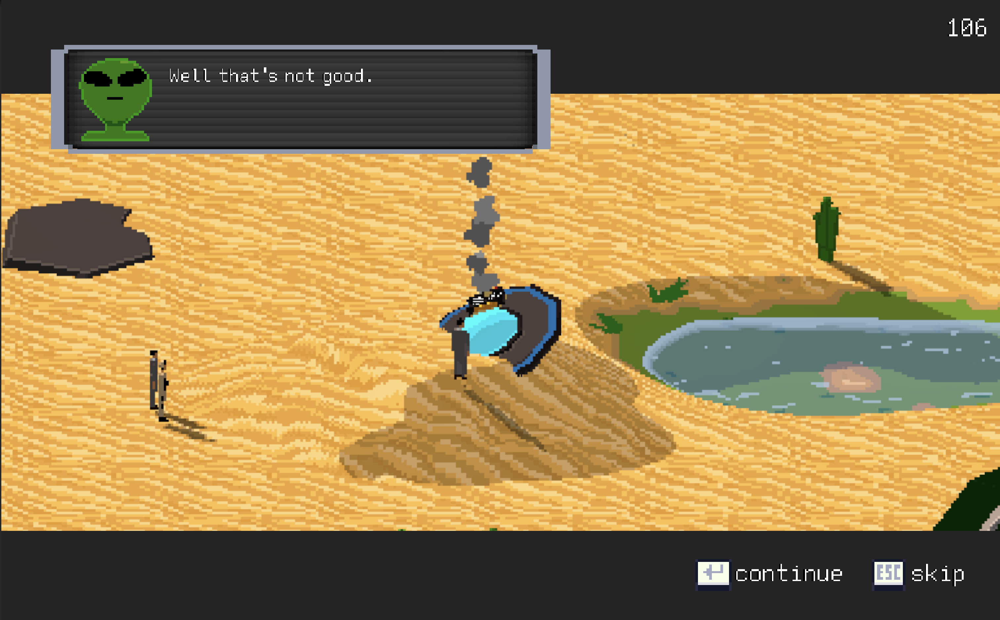
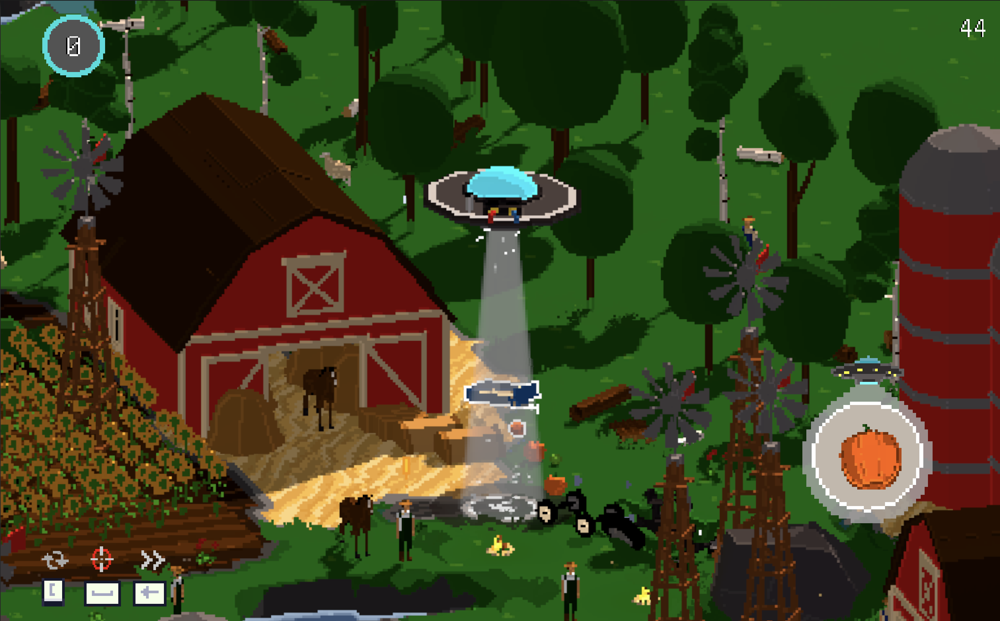
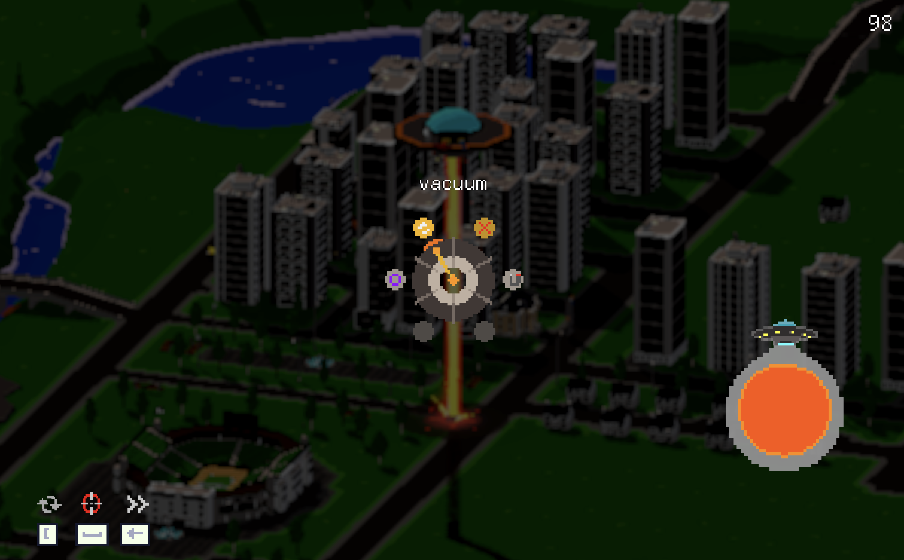
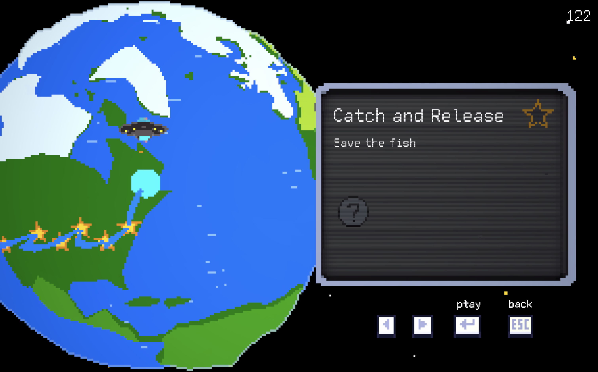

**Neebo's Big Adventure** is not really a game, but moreso a whacky adventure prototype where you help Neebo pilot his prized UFO, collect Earthly goodies, and repair his ship to make it home

it mixes elements from Katamari Damacy and Untitled Goose Game into a sandbox that is hardly "playable" but surprisingly fun

the game has so much to love, but needs so much more work if it will ever make it anywhere past a single level demo

the project is, and always has been a multi-decade learning experience meant to push me to actually build **large** games

it was designed big enough to require real-scale content management and custom editor tools, with support for all platforms/consoles, screen sizes, low end devices, etc

while **Neebo** may never actually make it off Earth... what he has taught me along the way was well worth it