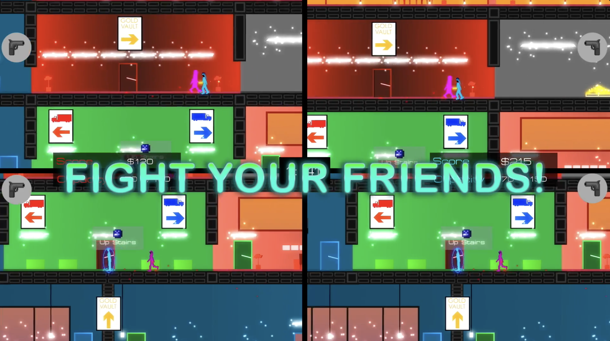
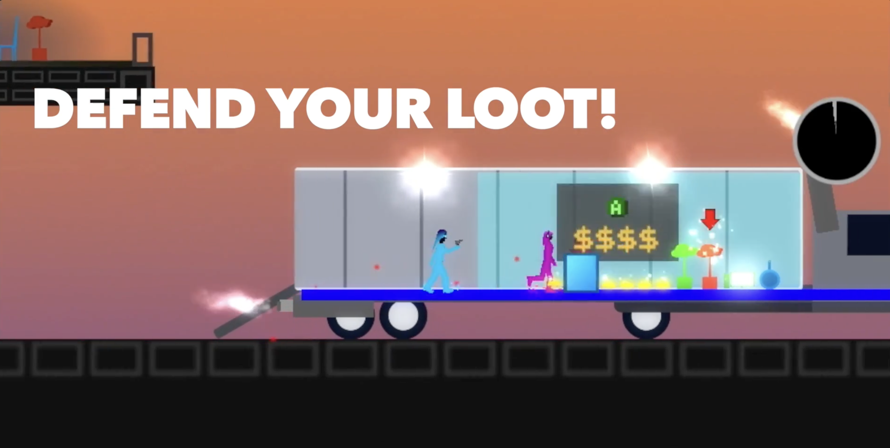
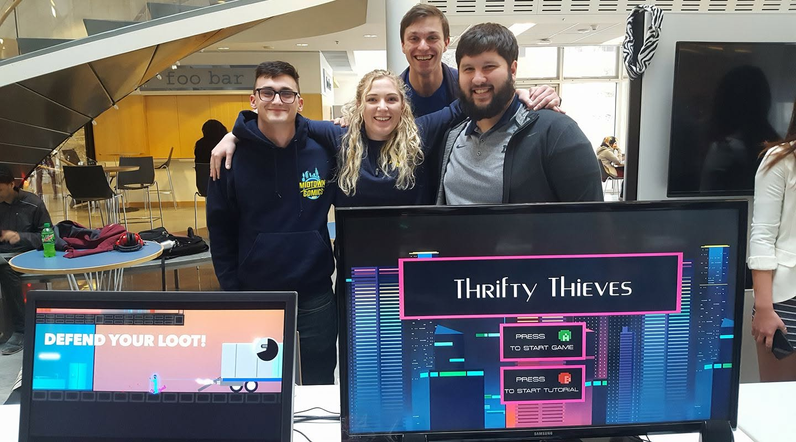

**Thrifty Thieves** is an action-packed 2v2 bank heist platformer where you and your friends sabotage eachother and battle to steal as much as you can before time runs out

the game was my final project for game design in a group with 3 classmates. it started as a platformer puzzle game where you play wizards that can morph into objects trying to rob a bank.

turns out puzzle design is difficult, and that idea never came to be

me and my good friend Scheebs were just testing out mechanics trying to figure out what to build when we realized it was fun to just shoot each other, and take whatever the other person was carrying at the time

we added a dodge roll, and a truck to throw goodies in, and the rest is history.

the late pivot saved our grade and we ended up placing 2nd in a game dev competition hosted by EA

