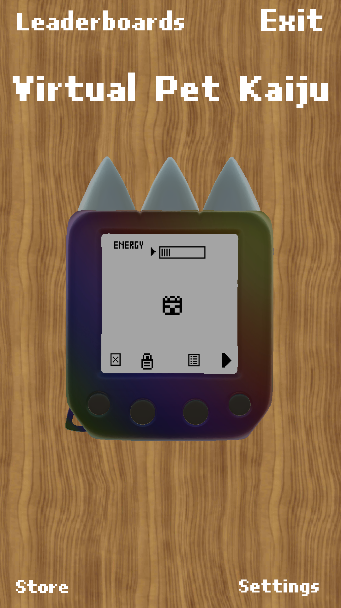
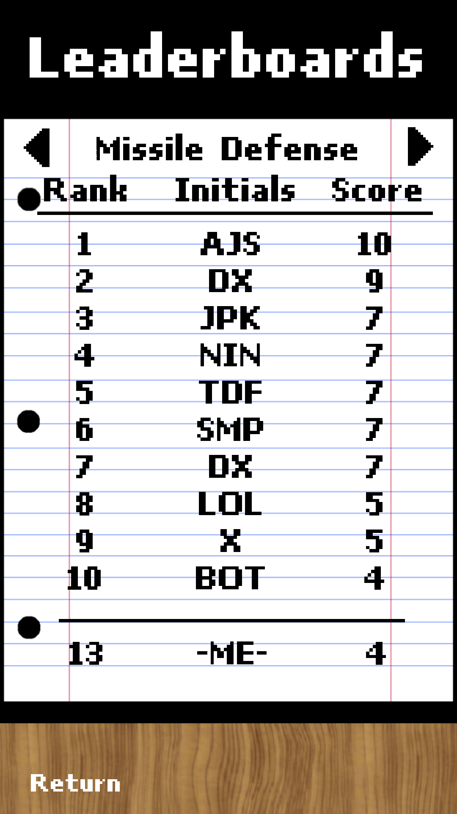

**Virtual Pet Kaiju** is a **Tamagotchi** on your phone. Raise a Kaiju from a baby, train it, watch it evolve, then send it into battle online!

**VPK** started as a passion-project between me and my older brother Cam. the inspiration was a lot of Godzilla and Ultraman, and when we were growing we were obsessed with **Digimon Virtual Pet Monsters**

sadly i remember my Digimon always devolving into the slug (Numemon, maybe?) because i was bad at taking care of it

eventually me and Cam started toying with making video games, largely me doing the programming, with Cam doing the art, theory-crafting, ideas

**Virtual Pet Kaiju** was originally an HTML web page before it was converted into a Unity app

i ended up using VPK as my capstone project for an apps & entrepreneurship course where i recruited some classmates to help with the multiplayer and ads integrations 

we released the game to the Play store but it received mixed reviews citing bad performance on old phones, mostly due to unoptimized 3D models
