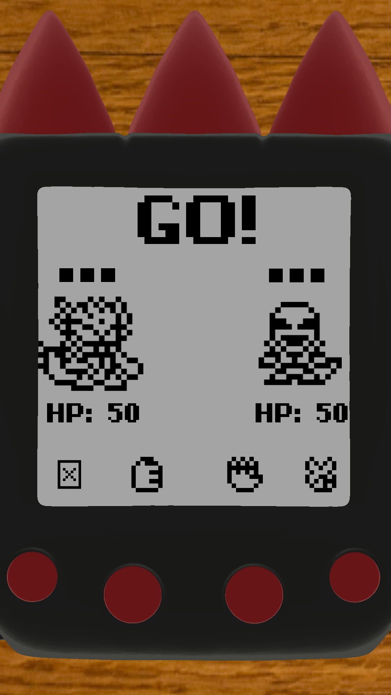

**Virtual Pet Kaiju** is a **Tamagotchi** on your phone. Raise a Kaiju from a baby, train it, watch it evolve, then send it into battle online!

**VPK** started as a passion-project between me and my older brother Cam. the inspiration is a lot of Godzilla, Ultraman, and when we were growing we were obsessed with **Digimon Virtual Pet Monsters**, but sadly i mostly remember my Digimon devolving into the slug creature (Numemon, maybe) because i was bad at taking care of it.

eventually we started toying with making video games, largely me doing the programming, and Cam doing the art, theory-crafting, idea guru, etc, he *always* had the harder job.

**Virtual Pet Kaiju** was originally an HTML web page, started when i took a web design course at Michigan, then converted into a Unity app when i took game design the following year.

i ended up using VPK as my capstone project for an apps & entrepreneurship course where i recruited some classmates to help with the multiplayer and ads integrations. 

we released the game to the Play store but it received mixed reviews citing bad performance on old phones, mostly due to unoptimized 3D models.
